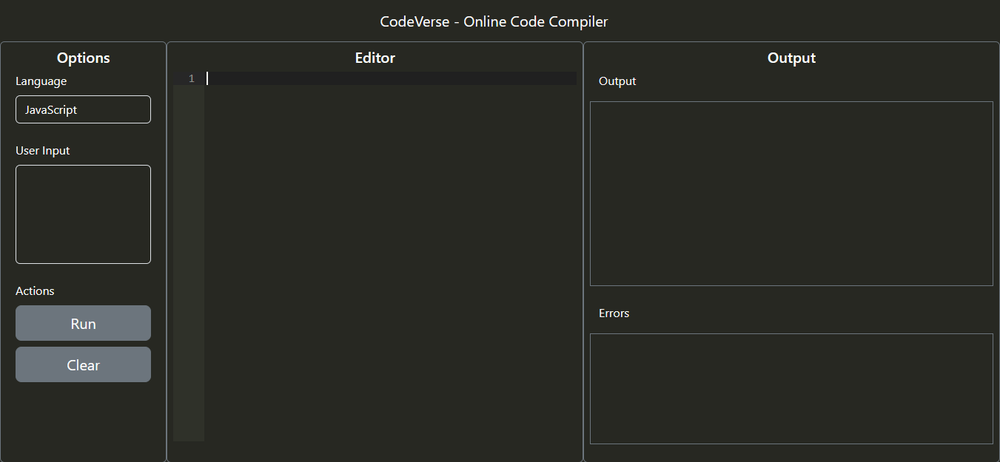

# CodeVerse - Online Code Compiler

CodeVerse is an online code compiler that allows users to write, compile, and test code right in their web browser. It provides a convenient and user-friendly interface for executing code in various programming languages. This project is built using ReactJS and utilizes the Code Compiler API for code compilation.

## Screenshot

## Getting Started

To run this project locally, follow these steps:

1. Clone the repository: `git clone <repository-url>`
2. Install the dependencies: `npm install`
3. Start the development server: `npm run dev`
4. Open your web browser and navigate to `http://localhost:5173` to access the CodeVerse application.

## API Integration

CodeVerse integrates with the [CodeX API](https://github.com/Jaagrav/CodeX-API) for code compilation and execution. 

## Contributions

Contributions to CodeVerse are welcome! If you find any bugs, issues, or have suggestions for improvements, please open an issue or submit a pull request. Make sure to follow the project's code style and guidelines.

## Acknowledgements

- The Codex API for providing the code compilation functionality.
- The ReactJS and React Bootstrap communities for their excellent libraries and resources.

## Contact

For any inquiries or further information about CodeVerse, please contact [Vikram Samak](mailto:vikramsamak02@gmail.com).
